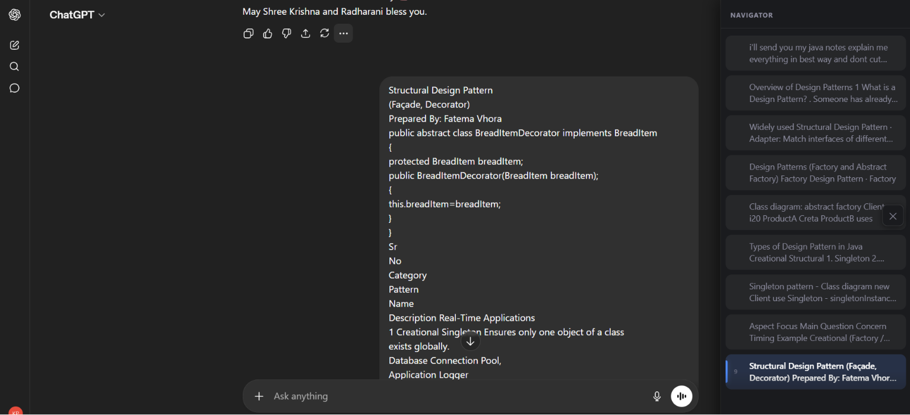
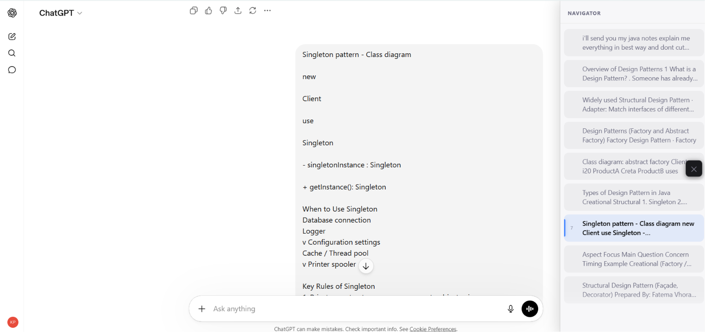
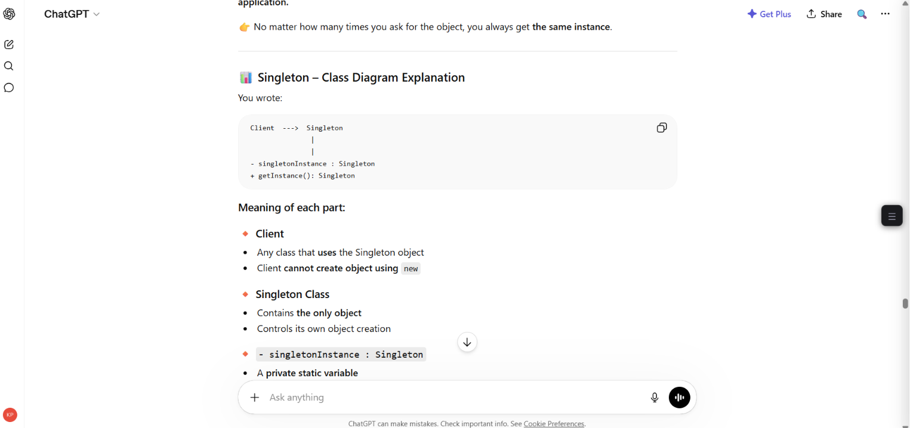

# ChatGPT Sidebar Navigator

A lightweight Chrome extension that injects a fixed right-side navigator sidebar into ChatGPT, letting you jump between your prompts instantly without scrolling.

---

## Overview

When you have a long ChatGPT conversation, finding a specific prompt means scrolling through hundreds of messages. This extension extracts all your user prompts, lists them in a clean sidebar, and lets you click any item to scroll directly to that message. The active prompt is highlighted automatically as you scroll.

---

## Features

- Fixed right-side sidebar (320px desktop, responsive on tablet and mobile)
- Extracts and lists all user prompts with sequential numbering (1 → N)
- Click any sidebar item to smooth-scroll to that message
- Active prompt auto-highlights as you scroll (IntersectionObserver)
- Dark and light theme support - syncs with ChatGPT's own theme
- Toggle button always visible on the right edge
- Works on both `chat.openai.com` and `chatgpt.com`
- Resilient message detection with 6 fallback selectors
- Sidebar state (open/closed) persisted via `chrome.storage`

---

## Installation

### Load as Unpacked Extension (Developer Mode)

1. Download or clone this repository:
   ```
   git clone https://github.com/KRISHTI2503/chatgpt-sidebar-navigator-extension.git
   ```
   Or download the ZIP from GitHub → **Code → Download ZIP** and extract it.

2. Open Chrome and go to:
   ```
   chrome://extensions
   ```

3. Enable **Developer mode** (toggle in the top-right corner).

4. Click **Load unpacked**.

5. Select the `chatgpt-sidebar-navigator` folder (the one containing `manifest.json`).

6. The extension is now active. Open [chatgpt.com](https://chatgpt.com) and start a conversation.

---

## How to Use

- The sidebar appears on the right side automatically when you open ChatGPT.
- Click the **☰** button on the right edge to toggle the sidebar open or closed.
- Each prompt in your conversation appears as a numbered card in the sidebar.
- Click any card to scroll directly to that message.
- The currently visible prompt is highlighted automatically as you scroll.

---

## Screenshots

| Sidebar Open (Dark) | Sidebar Open (Light) |
|:-------------------:|:--------------------:|
|  |  |

| Close Button UI |
|:---------------:|
|  |

---

## Tech Stack

- **Manifest V3** Chrome Extension
- Vanilla JavaScript (no frameworks, no build step)
- CSS custom properties for theming
- `IntersectionObserver` for scroll sync
- `MutationObserver` for dynamic DOM detection
- `chrome.storage.local` for state persistence

---

## Project Structure

```
chatgpt-sidebar-navigator/
├── manifest.json      # Extension manifest (MV3)
├── content.js         # All extension logic
└── styles.css         # Sidebar styles and theming
```

---

## Future Improvements

- Search/filter prompts inside the sidebar
- Export conversation prompts as text or markdown
- Keyboard shortcuts for navigation
- Pinned/starred prompts
- Support for ChatGPT Projects and shared chats

---

## Updating the Extension

After pulling new changes from this repo:

1. Go to `chrome://extensions`
2. Find **ChatGPT Sidebar Navigator**
3. Click the **refresh** icon (↺)

The extension reloads with the latest code — no need to re-add it.

---

## License

MIT
